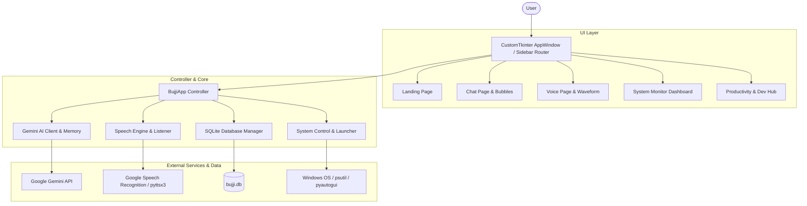

# BUJJI AI — Modern Desktop Assistant

<div align="center">

# 🤖 BUJJI AI

**An AI-powered cross-platform desktop assistant with conversational AI, voice interaction, system automation, multimodal document processing, and developer productivity features built using Python, CustomTkinter, Gemini API, Speech Recognition, and modern UI principles.**

[](https://python.org)
[](https://github.com/TomSchimansky/CustomTkinter)
[](https://ai.google.dev/)
[](LICENSE)

---

</div>

## 🌟 Overview

**BUJJI AI** is a modern desktop assistant designed to replace legacy GUI tools with a sleek, ChatGPT-inspired user experience. Powered by Google Gemini AI, local voice processing, system automation, and SQLite persistence, BUJJI AI serves as an intelligent productivity hub for developer work, daily organization, system monitoring, and hands-free voice assistance.

---

## ✨ Features

### 🎨 Modern Glassmorphism UI
- **Dark Palette**: Deep Black (`#0A0E1A`), Card Navy (`#1E293B`), Accent Purple (`#8B5CF6`), Neon Cyan (`#06B6D4`), Neon Green (`#00F5D4`).
- **Sidebar Router**: 13 feature tabs with active indicators and smooth page switching.
- **ChatGPT Layout**: User/AI message bubbles with avatars, timestamps, code blocks, copy actions, and typing indicators.

### 🤖 Conversational AI & Context Memory
- **Persistent Context**: SQLite-backed chat history with session management and title generation.
- **6 Personality Modes**: Friendly, Professional, Teacher, Motivator, Funny, Developer.
- **Prompt Templates**: One-click shortcuts for Python code generation, SQL queries, HTML/CSS components, debugging, Git help, and Docker configurations.

### 🎤 Voice Interaction & Waveform Visualization
- **Wake Word Detection**: Responds to *"Hey Bujji"*.
- **Waveform Canvas**: Dynamic purple-to-cyan audio amplitude visualizer.
- **TTS Engine**: Non-blocking speech output with customizable voice selection.

### 📊 System Automation & Monitoring
- **Resource Dashboard**: Live CPU, RAM, Disk storage utilization, and battery charge metrics.
- **Process Manager**: Top active processes table by RAM usage with system lock commands.
- **App Launcher**: Open Notepad, VS Code, Chrome, File Explorer, Calculator, and Command Prompt.

### ⚡ Productivity & Document AI
- **Document AI**: Extract and summarize text from PDF files.
- **Pomodoro Focus Timer**: 25-minute focus cycles with pause/reset.
- **Security & Tools**: Strong password generator & QR Code maker.
- **Reminders & Checklist**: Task manager with checkable items.

### 🌤 Weather & News Dashboards
- **Weather Lookup**: Live temperatures, humidity, and wind conditions for worldwide cities.
- **News Dashboard**: Google RSS news reader across Technology, AI, India, and World categories.

---

## 🏛️ System Architecture



---

## 📁 Repository Structure

```
AI-virtual-voice-assistant/
├── main.py                     # Main application entry point
├── requirements.txt            # Package dependencies
├── README.md                   # Repository documentation
├── .env.example                # Environment variable template
├── bujji/                      # Core package
│   ├── __init__.py
│   ├── __main__.py             # Module runner (python -m bujji)
│   ├── app.py                  # Central application controller
│   ├── config.py               # Constants, environment loading, settings
│   ├── ui/                     # UI Layer
│   │   ├── theme.py            # Design tokens & dark color palette
│   │   ├── app_window.py       # Main CTk window & navigation router
│   │   ├── sidebar.py          # Collapsible navigation sidebar
│   │   ├── landing_page.py     # Home screen with widgets
│   │   ├── chat_page.py        # ChatGPT conversation view
│   │   ├── voice_page.py       # Voice mode & waveform visualizer
│   │   ├── system_monitor.py   # Live hardware monitor dashboard
│   │   ├── weather_page.py     # Weather lookup dashboard
│   │   ├── news_page.py        # RSS news feed dashboard
│   │   ├── reminders_page.py   # Todo checklist & reminders
│   │   ├── camera_page.py      # Webcam snapshot tool
│   │   ├── games_page.py       # Mini game hub
│   │   ├── settings_page.py    # Preferences & API key config
│   │   ├── files_page.py       # File directory browser
│   │   ├── productivity_page.py# Pomodoro, QR, Password, PDF AI
│   │   ├── developer_page.py   # Code templates, GitHub/LeetCode stats
│   │   └── components/         # Reusable UI widgets
│   ├── ai/                     # AI Subsystem (Gemini API, Context, Prompts)
│   ├── voice/                  # Speech Subsystem (STT, TTS, Waveform)
│   ├── automation/             # OS Controls, Browser, App Launcher
│   ├── productivity/           # Timers, QR Gen, Password Gen
│   └── data/                   # SQLite Persistence
```

---

## 🚀 Quick Start Guide

### 1. Prerequisites
- Python 3.9+
- Windows 10/11, Linux, or macOS

### 2. Installation
```bash
# Clone the repository
git clone https://github.com/gautami1407/AI_virtual_voice_assistant.git
cd AI_virtual_voice_assistant

# Install dependencies
pip install -r requirements.txt
```

### 3. Environment Configuration
Copy `.env.example` to `.env` and insert your Gemini API Key:
```bash
cp .env.example .env
```

Edit `.env`:
```env
GOOGLE_API_KEY=your_gemini_api_key_here
WEATHER_API_KEY=your_openweather_api_key_here
```

### 4. Running the Assistant
```bash
python main.py
```
*(Or run `python -m bujji` from any directory).*

---

## 📜 License

This project is licensed under the MIT License — see the [LICENSE](LICENSE) file for details.